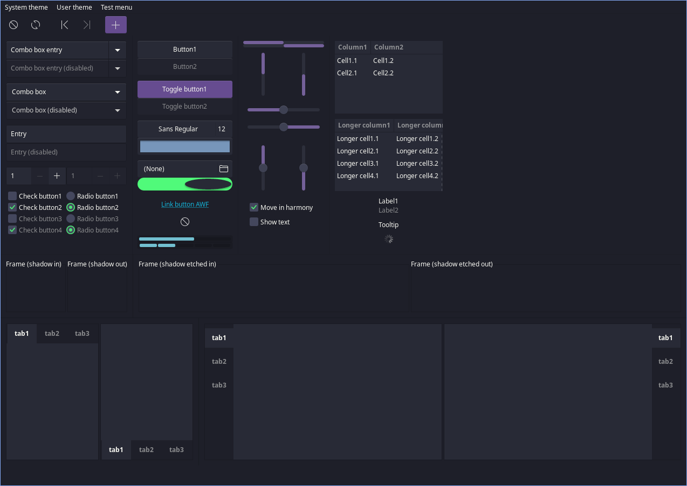
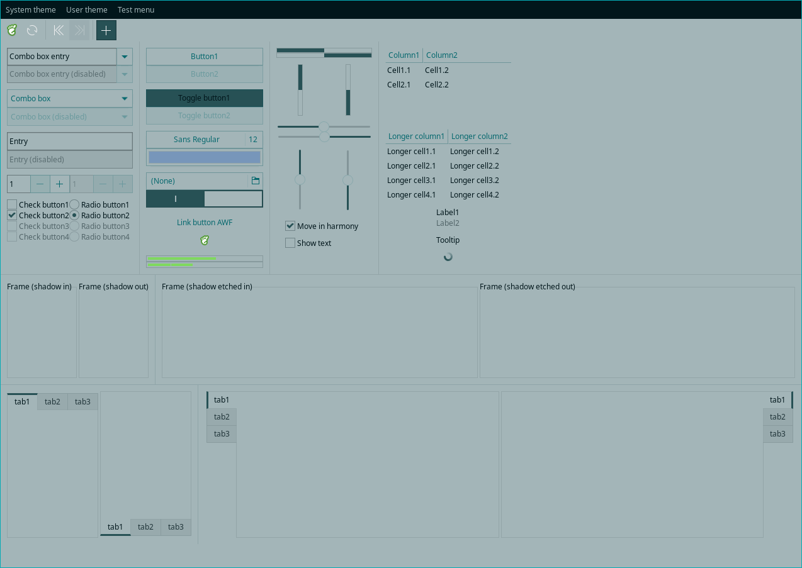
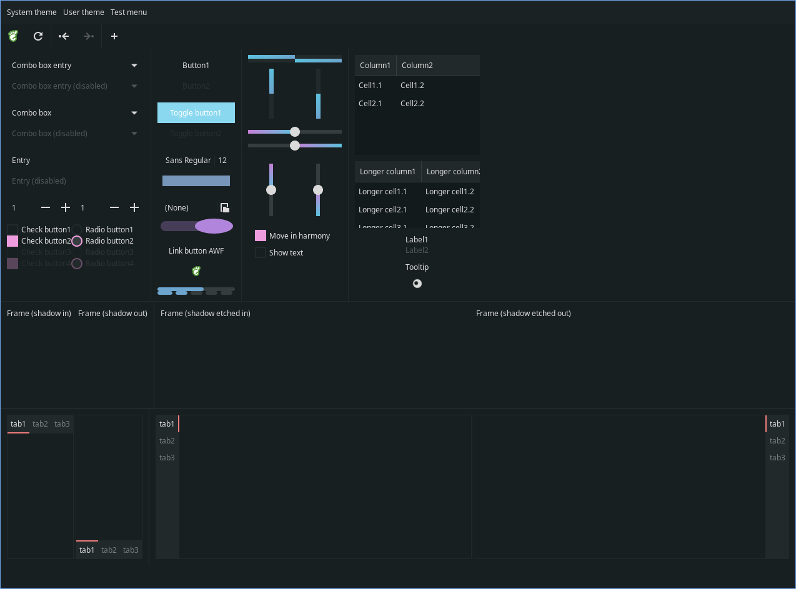
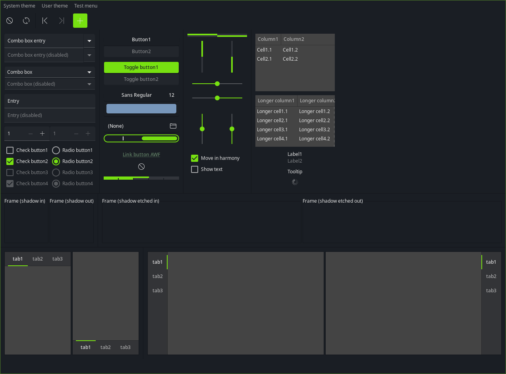

GTK Widget Factory
======================

Description
-----------

A widget factory is a theme preview application for gtk2 and gtk3.
It displays the various widget types provided by gtk2/gtk3 in a single window allowing to see the visual effect of the applied theme.

Features
--------

  * Display widget types available in gtk2/gtk3 (remark: option menu widget type only exists in gtk2, switch and level bar widget types only exist in gtk3)
  * Menus to select the themes available either at system level or user level
  * Toolbar button to start the other gtk version of the tool
  * Toolbar button to refresh the current theme (not working anymore in latest versions of gtk3)
  * Refresh the current theme on SIGHUP

Installation
------------

  * Ubuntu

    ```bash
    sudo apt-add-repository ppa:flexiondotorg/awf  
    sudo apt update  
    sudo apt install awf
    ```

  * Archlinux (AUR)

    ```bash
    yay -S awf-git
    ```

  * RPM based distro

    There is no pre-built package (yet) but you can generate RPM like this:
    
    ```bash
    ./autogen.sh  
    ./configure  
    make rpm
    ```

  * From source

    ```bash
    ./autogen.sh  
    ./configure  
    make  
    make install
    ```
  
  * Exodia OS

  ```bash
  install gtk-widget-factory-git
  ```

Dependencies
------------

  * gtk2 version 2.24
  * gtk3

<!-- showcase -->

Screenshots
-----------

|  |  |
|--|--|
|  |  |
|  |  |

<!-- showcase -->

License
-------

  A widget factory is provided under the terms of the GNU GPLv3 license.
  See the COPYING file for details.

Author
------

  Valère Monseur (valere dot monseur at ymail dot com)

Thanks to
---------

  * Ottoman Kent (for testing in ubuntu and bug report)
  * Dwight Engen (for rpm specification file: awf.spec.in)
  * Josef Radinger (for sorted menus, text in progress bars, treeviews with(out) scrollbars)
